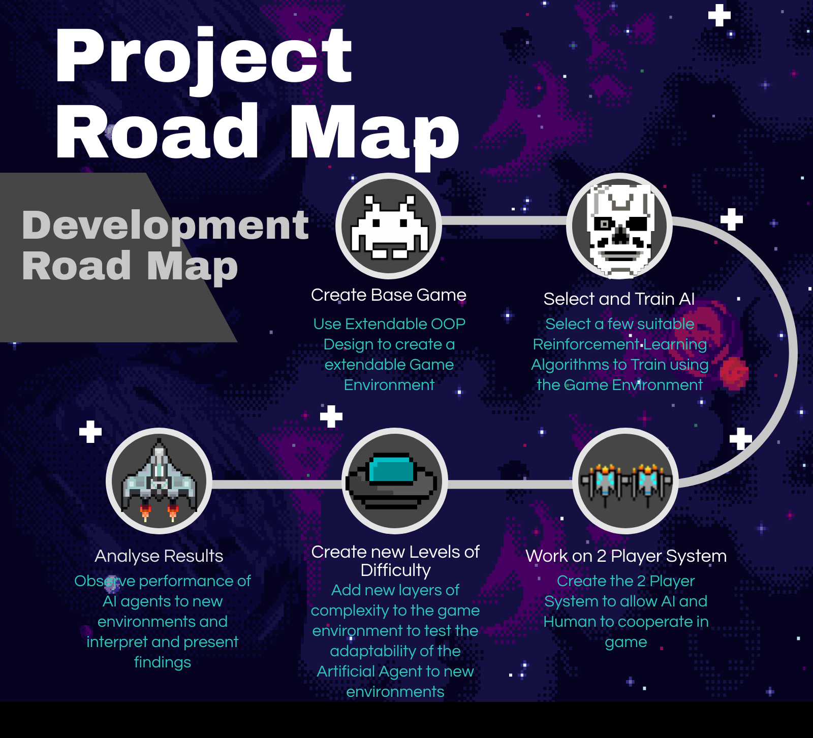

# Orbital project 2020 
Team name: Space Defenders

Level of achievement: Artemis

* Video Links 
  - LiftOff: [Liftoff Video](https://youtu.be/UNIIZMoY21Y)
  - Milestone 1: [Milestone 1 Video](https://youtu.be/B_vnh2F5NsM)
  - Milestone 2: [Milestone 2 Video](https://www.youtube.com/watch?v=oTaomwA8UFw)
  - Milestone 3: [To be updated](#)

* Download Link: [Windows](https://drive.google.com/file/d/1hl9ZfLfdFUbhuicCBJrC9TU6vuIL0XSc/view?usp=sharing)
* Download Link: [Mac](https://drive.google.com/file/d/1iaOJq8udqXCtAyodes7kMmCAVzpx6xyb/view?usp=sharing)

### Objectives:
1. Make a Space invaders game
2. Make use of AI to play the game decently.
3. Combine them together for more immersive gameplay experience

### Tech Stack
1. Gameplay and Graphics
    - Pygame: Used for making the game and the animations
2. AI and Data Science Technologies
    - Gym: For making the AI agent for the game
    - Pytorch: Provides the Neural Network Infrastructure
    -  Numpy: Fast Array Computation
    -  Matplotlib: Visualising Data and Debugging
    -  OpenCV 2: Image Preprocessing and playing back video
3. Optimisation Technologies
    -  Multiprocessing and Asyncio: Running stuff in parallel to make them faster
    -  Sockets and pickle: For sending data across the network
    -  Sqlite3: For storing items in the databases
4. Software Engineering
    -  PyUnit: For unit tests
    -  Logging: For logging for data
    -  cx_Freeze: Compilation of python to executable

### Development RoadMap

### Task:
- [x] Create a basic UI in pygame
- [x] Draw the sprites for the characters
- [x] Create a configuration parser to parse configurations
- [x] Create a database to keep track of the high scores
- [x] Make the player shoot bullets
- [x] Make the enemy sprites
- [x] Track collision between bullets and different entities
- [x] Find a way to scale difficulties
- [x] Add 2 player PVP
- [x] Add 2 player Co-op mode
- [x] Added background music
- [x] Try DQN for AI
- [ ] Try Evolutionary networks (In progress)
- [ ] Added AI to play the game

### Optional Features
- [x] Player able to play the game with his keyboard
- [x] Create a settings menu
- [x] Endless mode where the player can shoot endless enemies
- [ ] Create a story mode with bosses
- [ ] View mode for the player to see the AI play the game
- [ ] Compete mode where the player can compete with the AI in the game

### Useful Links
* Orbital main webpage: [here](https://orbital.comp.nus.edu.sg/)
* Orbital projects page: [here](https://nusskylab-dev.comp.nus.edu.sg/public_views/public_projects)

### Contributors
* Stephen: [LinkedIn](https://www.linkedin.com/in/stephen-tan-hin-khai/)
* Junhua: [LinkedIn](https://www.linkedin.com/in/junhua-wen-718880137/)

### Project Log
* Project Log: [Link](https://docs.google.com/spreadsheets/d/1-_kZFH19Hje2CUJDWniRJlIA7P6K9FkfxaT8GMf7p-U/edit?usp=sharing)

### Program Flow

