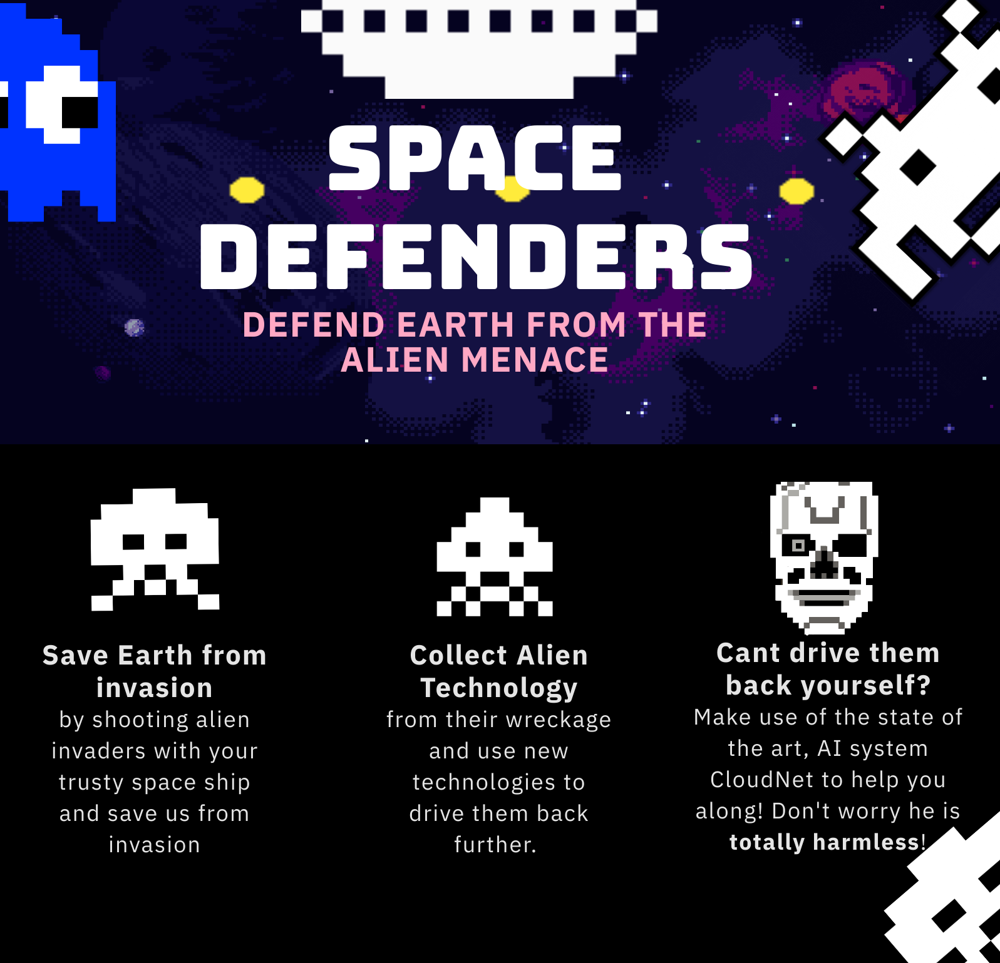
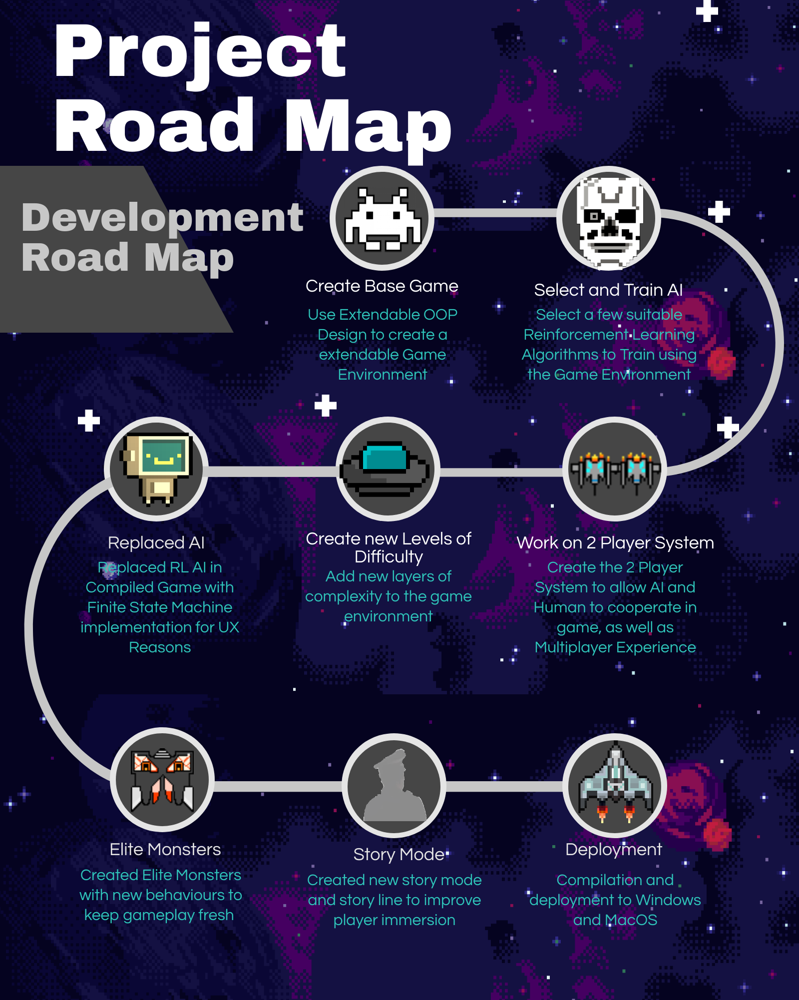
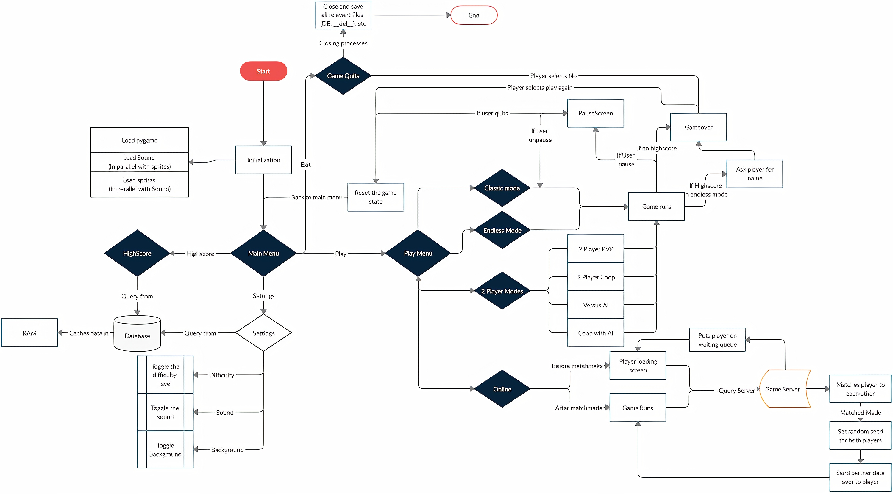

# Orbital project 2020 
Team name: Space Defenders

Level of achievement: Artemis

* Video Links 
  - LiftOff: [Liftoff Video](https://youtu.be/UNIIZMoY21Y)
  - Milestone 1: [Milestone 1 Video](https://youtu.be/B_vnh2F5NsM)
  - Milestone 2: [Milestone 2 Video](https://www.youtube.com/watch?v=oTaomwA8UFw)
  - Milestone 3: [To be updated](#)

* Download Link: [Windows v1.0](https://drive.google.com/file/d/1sg8KXjIIUoKLrhnO1ZvNEcx9PiAcC4ad/view?usp=sharing)

* Download Link: [Mac v1.0](https://drive.google.com/file/d/1HfSrewqjheuAdSa83yHG1T8vIK-0Iw7c/view?usp=sharing)

* Feedback Link: [here](https://forms.gle/kibPWXRtb1x3JJvT9)
Click here to provide any feedback you want to share

### Objectives:
1. Make a Space invaders game
2. Make use of AI to play the game decently.
3. Combine them together for more immersive gameplay experience

### Tech Stack
1. Gameplay and Graphics
  - Pygame: Used for making the game and the animations
2. AI and Data Science Technologies
  - Gym: For making the AI agent for the game
  - Pytorch: Provides the Neural Network Infrastructure
  - Numpy: Fast Array Computation
  - Matplotlib: Visualising Data and Debugging
  - OpenCV 2: Image Preprocessing and video playback
3. Optimisation Technologies
  - Multiprocessing and Asyncio: Running stuff in parallel to make them faster
  - Sockets and pickle: For sending data across the network
  - Sqlite3: For storing items in the databases
4. Software Engineering
  - PyUnit: For unit tests
  - Logging: For logging for data
  - cx_Freeze: Compilation of python to executable

### Development RoadMap

### Proposal
* Link to proposal : [here](https://docs.google.com/document/d/1FzKTmnhRiYNqQPP4pEpr50egbKD4TC94Nx8LIj1bqZw/edit?usp=sharing)

### Useful Links
* Orbital main webpage: [here](https://orbital.comp.nus.edu.sg/)
* Orbital projects page: [here](https://nusskylab-dev.comp.nus.edu.sg/public_views/public_projects)

### Contributors
* Stephen: [LinkedIn](https://www.linkedin.com/in/stephen-tan-hin-khai/)
* Junhua: [LinkedIn](https://www.linkedin.com/in/junhua-wen-718880137/)

### Project Log
* Project Log: [Link](https://docs.google.com/spreadsheets/d/1-_kZFH19Hje2CUJDWniRJlIA7P6K9FkfxaT8GMf7p-U/edit?usp=sharing)

### Program Flow

